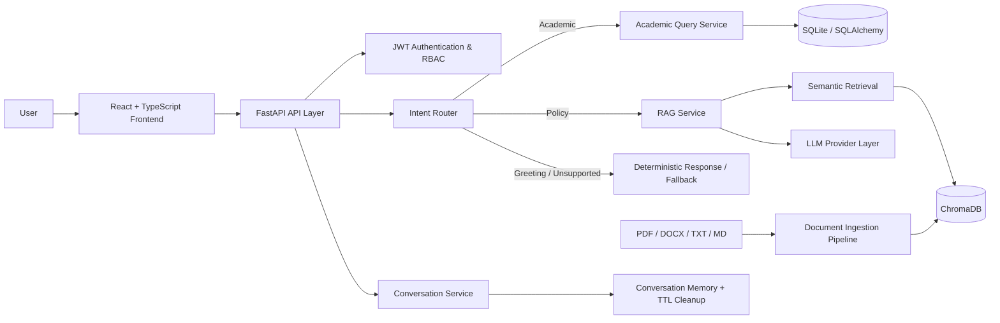

<div align="center">

# 🎓 IMCopilot

### AI-Powered University Copilot

**A dashboard-first academic portal enhanced with retrieval-augmented AI, secure student data access, role-based authentication, and an integrated conversational assistant.**

[](https://www.python.org/)
[](https://fastapi.tiangolo.com/)
[](https://react.dev/)
[](https://www.typescriptlang.org/)
[](https://www.trychroma.com/)
[](https://jwt.io/)

[Backend Documentation](./backend/README.md) · [Frontend Documentation](./frontend/README.md)

</div>

---

## Overview

IMCopilot is a university information system built around a simple principle: **the dashboard remains the primary academic workspace, while AI acts as an intelligent assistant rather than replacing the application itself**.

The platform combines traditional academic portal functionality with two distinct AI/data paths:

- **University policy & document questions** → semantic retrieval over institutional documents and grounded LLM responses.
- **Personal academic questions** → authenticated, student-scoped access to structured academic records.

Guest users can query public university information, while authenticated students can ask questions about their own academic data. Administrative functionality is separated through role-based access controls.

### Project ownership

IMCopilot was originated and technically led by **Najeeb Ullah**, who owned the AI/backend architecture and overall technical direction within a three-person team. The project was developed as a final-year academic project with separate frontend and documentation responsibilities across the team.

---

## Why IMCopilot?

University information is usually fragmented across portals, PDFs, policy documents, databases, and administrative systems. IMCopilot explores how those sources can be brought together behind a single secure interface without giving an LLM unrestricted access to sensitive data.

The system separates:

- **unstructured knowledge** from institutional documents,
- **structured student data** from the academic database,
- **authentication and authorization** from the AI layer,
- and **routing/orchestration** from individual domain services.

This keeps the assistant useful while preserving clear security and application boundaries.

---

## Core Capabilities

### 🤖 Intelligent Copilot
- Unified conversational interface for university-related questions
- Intent routing between greetings, academic data, institutional policy and fallback handling
- Grounded answers with source metadata
- Multi-intent detection and controlled fallback behavior
- Conversation lifecycle management with ownership and TTL cleanup

### 📚 Retrieval-Augmented Generation
- Document ingestion for **PDF, DOCX, TXT and Markdown** sources
- Text cleaning, chunking and metadata extraction
- Embedding generation and vector indexing with **ChromaDB**
- Semantic retrieval for university policy and institutional knowledge
- Context-grounded LLM responses rather than unrestricted generation

### 🎓 Academic Data Access
- Secure access to student-specific academic records
- Queries for information such as CGPA, attendance, courses, grades and timetable data
- Student-scoped database access rather than arbitrary SQL execution
- Database sources represented separately from document sources

### 🔐 Authentication & RBAC
- JWT-based authentication
- Password hashing
- Guest, Student and Administrator roles
- Protected academic routes
- Ownership checks for conversations and student data

### 🖥️ Dashboard-First Frontend
- Separate guest, student and administrator experiences
- Protected and public routing
- Student and admin layouts
- Integrated assistant workspace
- Theme support and reusable UI components
- API access through a centralized Axios client

---

## High-Level System Design



The API layer remains intentionally thin. Business logic lives inside service modules so authentication, retrieval, academic queries, LLM providers and conversation handling can evolve independently.

---

## Technology Stack

| Layer | Technologies |
|---|---|
| **Backend** | Python, FastAPI, Uvicorn, Pydantic Settings |
| **Data & ORM** | SQLite, SQLAlchemy |
| **Authentication** | JWT, Passlib/Bcrypt, RBAC |
| **RAG / Search** | ChromaDB, sentence-transformers, RapidFuzz |
| **Document Processing** | pdfplumber, python-docx |
| **LLM Layer** | Provider abstraction, mock mode, configurable external provider endpoints, response caching |
| **Frontend** | React 19, TypeScript, Vite, React Router |
| **UI** | Tailwind CSS, reusable component system, Lucide, Recharts, react-markdown |
| **Networking** | Axios |
| **Testing** | Pytest, HTTPX |

---

## Repository Structure

```text
im_copilot/
├── backend/
│   ├── app/
│   │   ├── api/            # FastAPI routes
│   │   ├── core/           # App factory, configuration, database, security
│   │   ├── models/         # Data models
│   │   ├── schemas/        # API schemas
│   │   └── services/       # RAG, LLM, academic, router, conversation logic
│   ├── documents/          # Source documents for ingestion
│   ├── tests/              # Backend tests
│   ├── requirements.txt
│   └── README.md
└── frontend/
    ├── src/
    │   ├── app/            # Application bootstrap
    │   ├── components/     # Reusable UI and feature components
    │   ├── layouts/        # Student/admin application layouts
    │   ├── pages/          # Route-level pages
    │   ├── providers/      # Shared application state
    │   ├── routes/         # Public/protected routing
    │   └── config/         # Runtime configuration
    ├── package.json
    └── README.md
```

---

## Quick Start

### 1. Clone the repository

```bash
git clone https://github.com/najeebafridi/im_copilot.git
cd im_copilot
```

### 2. Start the backend

```bash
cd backend
python -m venv .venv
```

Activate the environment:

```bash
# Windows PowerShell
.\.venv\Scripts\Activate.ps1

# macOS / Linux
source .venv/bin/activate
```

Install dependencies and run the API:

```bash
pip install -r requirements.txt
uvicorn app.main:app --reload
```

Backend: `http://127.0.0.1:8000`  
Swagger UI: `http://127.0.0.1:8000/docs`

For database initialization, document ingestion, LLM configuration and testing, see the **[backend documentation](./backend/README.md)**.

### 3. Start the frontend

```bash
cd ../frontend
npm install
npm run dev
```

Frontend: `http://127.0.0.1:5173`

See the **[frontend documentation](./frontend/README.md)** for configuration and project structure.

---

## Security Design

IMCopilot intentionally avoids giving the language model direct unrestricted access to application data.

- Personal academic requests require authentication.
- Academic queries are scoped to the authenticated user.
- Role checks are enforced in backend services/routes.
- Guest users cannot access personal student information.
- Document-based RAG and structured academic queries use separate service paths.
- JWT secrets and external provider credentials should be configured through environment variables rather than committed to source control.

This separation is a central engineering decision, not an afterthought.

---

## API & Developer Documentation

When the backend is running, interactive API documentation is available at:

```text
http://127.0.0.1:8000/docs
```

Useful implementation areas include:

- `/api/v1/auth` — authentication
- `/api/v1/documents` — document ingestion
- `/api/v1/rag` — retrieval/search
- `/api/v1/copilot` — unified copilot workflow
- `/api/v1/academic` — authenticated academic queries
- `/api/v1/chat` — conversation lifecycle
- `/api/v1/health` — health check

Exact request/response schemas are documented automatically by FastAPI's OpenAPI interface.

---

## Testing

Backend tests:

```bash
cd backend
pytest
```

Frontend production build:

```bash
cd frontend
npm run build
```

---

## Current Scope

The current project focuses on a controlled academic-assistant workflow. Public self-registration is intentionally excluded; university-managed identities remain the trust boundary.

Potential future extensions include persistent conversation history, richer attachments, voice, streaming responses, additional university roles and expanded notification capabilities.

---

## Documentation

- **[Backend README](./backend/README.md)** — API, services, configuration, ingestion and testing
- **[Frontend README](./frontend/README.md)** — React structure, routes, configuration and development

---

## Author

**Najeeb Ullah**  
Project Originator · Team Lead · Lead AI/Backend Developer  
AI Engineer & Machine Learning Researcher

[GitHub](https://github.com/najeebafridi) · [Research DOI](https://doi.org/10.33411/IJIST/1865)

---

<div align="center">
<sub>Built as an applied AI system where retrieval, structured data access, authorization and user experience are treated as separate engineering concerns.</sub>
</div>
