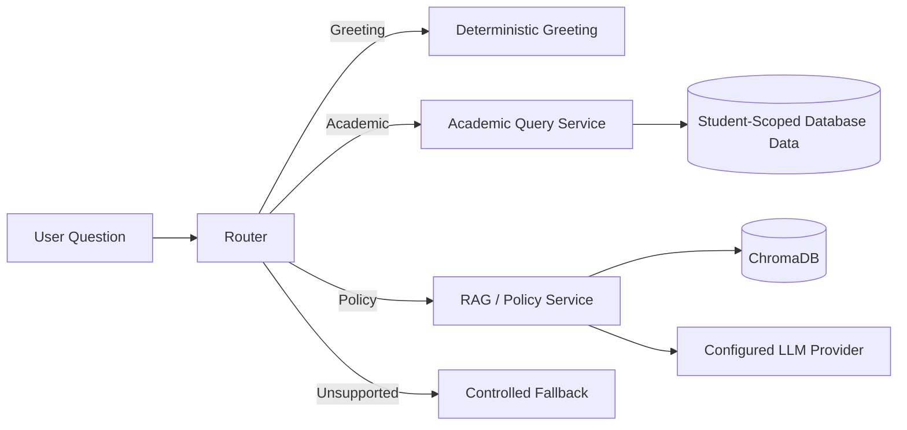

# IMCopilot Backend

The IMCopilot backend is a **FastAPI-based academic assistant service** that combines authentication, student-scoped structured-data access, document retrieval, configurable LLM providers, conversation management and intent routing behind a single API.

This document focuses on the backend implementation. For the complete system overview, see the **[project README](../README.md)**.

---

## Responsibilities

The backend owns:

- JWT authentication and role-based access control
- student/admin identity and authorization
- university document ingestion and vector indexing
- semantic retrieval over institutional documents
- structured academic queries against the application database
- LLM provider abstraction and optional response caching
- intent classification/routing between academic, policy and fallback paths
- conversation IDs, message ownership and memory lifecycle
- API schemas, validation, health checks and error handling

The API layer is intentionally kept thin; most application behavior lives inside service modules.

---

## Stack

| Area | Technologies |
|---|---|
| API | FastAPI, Uvicorn |
| Configuration | Pydantic Settings, python-dotenv |
| Database | SQLite, SQLAlchemy |
| Authentication | JWT, python-jose, Passlib/Bcrypt |
| Vector Search | ChromaDB |
| Embeddings / Retrieval | sentence-transformers, RapidFuzz |
| Document Parsing | pdfplumber, python-docx |
| LLM Integration | Configurable provider abstraction, mock mode, response cache |
| Testing | Pytest, HTTPX |

---

## Backend Structure

```text
backend/
├── app/
│   ├── api/
│   │   ├── router.py
│   │   └── v1/             # auth, chat, copilot, RAG, documents, academic, health
│   ├── core/               # app factory, configuration, DB, security, logging
│   ├── models/             # persistence/domain models
│   ├── schemas/            # request and response models
│   └── services/
│       ├── academic/       # student-scoped academic data queries
│       ├── conversation/   # conversation lifecycle and cleanup
│       ├── copilot/        # grounded policy/document responses
│       ├── llm/            # provider abstraction and validation
│       └── router/         # intent routing/orchestration
├── data/
│   └── chroma/             # local vector store
├── documents/              # source documents for ingestion
├── processed/              # ingestion/debug outputs
├── tests/
├── init_db.py
├── seed.py
├── requirements.txt
└── README.md
```

---

## Setup

### Requirements

- Python **3.13** recommended for the current project environment
- `pip`

### 1. Create a virtual environment

```bash
cd backend
python -m venv .venv
```

Activate it:

```bash
# Windows PowerShell
.\.venv\Scripts\Activate.ps1

# macOS / Linux
source .venv/bin/activate
```

### 2. Install dependencies

```bash
pip install -r requirements.txt
```

### 3. Configure environment variables

Copy the example environment file:

```bash
# Windows
copy .env.example .env

# macOS / Linux
cp .env.example .env
```

The backend works in **mock LLM mode by default**, allowing local development without external provider credentials.

Important settings include:

```env
DATABASE_URL=sqlite:///./im_copilot.db
JWT_SECRET_KEY=replace-with-a-secure-secret
MOCK_LLM=True
LLM_PROVIDER=mock
LLM_API_KEY=
LLM_BASE_URL=
LLM_MODEL=
DOCUMENTS_PATH=documents
CHROMA_PATH=data/chroma
ROUTER_DEBUG=False
```

Do not commit real API keys or production JWT secrets.

---

## Database

Initialize the local database:

```bash
python init_db.py
```

Seed development/demo data when required:

```bash
python seed.py
```

The default database configuration is SQLite:

```text
sqlite:///./im_copilot.db
```

The academic-query layer is designed to return data scoped to the authenticated user rather than exposing unrestricted database access.

---

## Run the API

```bash
uvicorn app.main:app --reload
```

The application runs at:

```text
http://127.0.0.1:8000
```

Interactive Swagger/OpenAPI documentation:

```text
http://127.0.0.1:8000/docs
```

Health check:

```text
GET /api/v1/health
```

---

## API Areas

| Area | Purpose |
|---|---|
| `/api/v1/auth` | Login/authentication workflows |
| `/api/v1/documents` | Document ingestion/index management |
| `/api/v1/rag` | Retrieval and semantic search |
| `/api/v1/llm` | LLM/provider test functionality |
| `/api/v1/copilot` | Unified assistant routing and responses |
| `/api/v1/academic` | Authenticated academic-data queries |
| `/api/v1/chat` | Conversation lifecycle operations |
| `/api/v1/health` | Service health |

Use Swagger UI for the exact methods, schemas and current request/response contracts.

---

## Document Ingestion & RAG

Source files are placed in:

```text
backend/documents/
```

Supported document types include:

- PDF
- DOCX
- TXT
- Markdown

The ingestion pipeline performs document loading, normalization, chunking, metadata creation, embedding and indexing. The vector database is stored locally under:

```text
backend/data/chroma/
```

Processed/debug outputs can be written under:

```text
backend/processed/
```

A typical local workflow is:

1. Place university/policy documents in `documents/`.
2. Start the FastAPI service.
3. Trigger the document ingestion endpoint through Swagger.
4. Inspect retrieval through the RAG search endpoint.
5. Query the copilot and verify grounded sources in its response.

---

## Routing & Copilot Flow

The unified copilot route separates different classes of request rather than sending every message directly to an LLM.



Academic requests require authentication. Policy/document requests use semantic retrieval. Unsupported questions are handled with a controlled fallback rather than unrestricted general-purpose answering.

The architecture documentation describes a LangGraph-oriented target design; the current public implementation uses the repository's router and service abstractions directly.

---

## LLM Provider Layer

Runtime configuration supports provider abstraction through environment variables such as:

```env
MOCK_LLM=True
LLM_PROVIDER=mock
LLM_API_KEY=
LLM_BASE_URL=
LLM_MODEL=
LLM_TEMPERATURE=0.7
LLM_MAX_TOKENS=256
ENABLE_CACHE=True
CACHE_SIZE=100
```

`MOCK_LLM=True` is useful for deterministic local development and tests without external API calls.

The service layer also contains provider/configuration error handling so provider failures can be translated into consistent API responses.

---

## Authentication & Security

Supported roles are centered around:

- **Guest** — public policy/document access only
- **Student** — authenticated access to the student's own academic data
- **Administrator** — administrative application role

Security boundaries include:

- JWT bearer authentication
- password hashing
- backend-enforced RBAC
- student-scoped academic responses
- protected routes for personal data
- separate policy/RAG and academic-data paths
- conversation ownership checks

The project intentionally does **not** treat the LLM as an authorization layer.

---

## Conversation Management

The backend owns conversation state and identifiers. Current runtime settings include:

```env
CHAT_MEMORY_ENABLED=True
CHAT_TTL_HOURS=24
CHAT_MAX_CONVERSATIONS_PER_USER=30
CHAT_MAX_MESSAGES_PER_CONVERSATION=200
CHAT_CLEANUP_INTERVAL_MINUTES=30
CHAT_MAX_TITLE_LENGTH=40
```

A cleanup scheduler starts with the FastAPI application lifecycle and removes expired in-memory conversation state according to configured limits.

---

## Testing

Run all backend tests:

```bash
pytest
```

For more verbose output:

```bash
pytest -v
```

The repository includes tests for areas such as authentication as well as backend API/service behavior.

---

## Development Notes

- Keep API routes thin; business logic belongs in services.
- Keep credentials and secrets in `.env`.
- Use the backend as the source of truth for conversation IDs and ownership.
- Do not let frontend code bypass backend authorization rules.
- Extend domain functionality through services rather than adding logic directly to route handlers.

For deeper architectural decisions, see **[`docs/IM_COPILOT_ARCHITECTURE_v2.md`](../docs/IM_COPILOT_ARCHITECTURE_v2.md)**.
