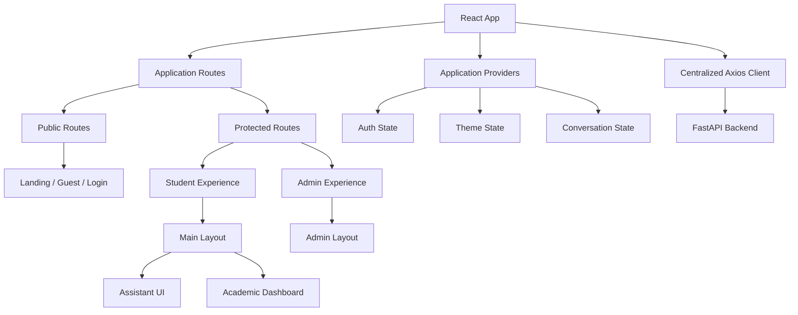

# IMCopilot Frontend

The IMCopilot frontend is a **React 19 + TypeScript + Vite** application that provides separate guest, student and administrator experiences around a dashboard-first academic portal with an integrated AI assistant.

For the complete system overview, see the **[project README](../README.md)**.

---

## Frontend Responsibilities

The frontend owns:

- public and protected application routing
- student and administrator layouts
- authentication state and session restoration
- reusable UI components
- assistant presentation and interaction modes
- application theme state
- API communication through a centralized Axios client
- route-level page composition
- charts, markdown rendering and notifications

The backend remains the source of truth for authentication, authorization, conversations and academic data.

---

## Stack

| Area | Technology |
|---|---|
| UI Framework | React 19 |
| Language | TypeScript |
| Build Tool | Vite 7 |
| Routing | React Router DOM |
| Styling | Tailwind CSS |
| Components | Reusable internal components / shadcn-style patterns |
| HTTP | Axios |
| Icons | Lucide React |
| Charts | Recharts |
| Markdown | react-markdown |
| Notifications | Sonner |

---

## Project Structure

```text
frontend/
├── src/
│   ├── app/              # app bootstrap and root component
│   ├── components/
│   │   ├── common/       # shared application components
│   │   └── ui/           # reusable UI primitives
│   ├── config/           # environment/runtime configuration
│   ├── layouts/          # main and administrator layouts
│   ├── pages/            # landing, auth, student/admin/guest pages
│   ├── providers/        # shared application state/providers
│   ├── routes/           # public/protected route definitions
│   └── ...
├── package.json
├── vite.config.js
└── README.md
```

---

## Application Model

IMCopilot intentionally uses different experiences for different user roles.

### Guest

Guest users can enter the public assistant experience without access to personal academic data.

### Student

Authenticated students enter the academic dashboard and can access protected student functionality. The AI assistant supplements the dashboard rather than replacing it.

### Administrator

Administrator routes use a separate layout and protected route flow suitable for administrative functionality.

---

## Routing

The frontend includes:

- public routes for landing/login/guest access
- protected student routes
- protected administrator routes
- role-aware navigation
- fallback/404 handling

Representative paths include:

```text
/
/login
/guest
/student
/admin
/admin/login
```

Route definitions and access control live under `src/routes/` rather than being scattered across pages.

---

## Setup

### Requirements

- Node.js (current LTS recommended)
- npm

### 1. Install dependencies

```bash
cd frontend
npm install
```

### 2. Configure environment variables

Copy the example configuration:

```bash
# Windows
copy .env.example .env

# macOS / Linux
cp .env.example .env
```

Default local configuration points to the FastAPI backend at:

```text
http://127.0.0.1:8000
```

Important frontend settings include:

```env
VITE_API_BASE_URL=http://127.0.0.1:8000
VITE_APP_NAME=IM Copilot
VITE_APP_VERSION=1.0.0
VITE_API_TIMEOUT_MS=15000
VITE_ENABLE_DEBUG=false
VITE_DEMO_MODE=false
```

### 3. Start development mode

```bash
npm run dev
```

Open:

```text
http://127.0.0.1:5173
```

---

## Available Scripts

### Development server

```bash
npm run dev
```

### Production build

```bash
npm run build
```

### Preview production build

```bash
npm run preview
```

---

## Authentication Flow

The frontend maintains authentication state and restores persisted sessions while the backend validates credentials and authorization.

The application supports:

- student login
- administrator login
- persistent or session-scoped browser storage
- protected-route redirects
- bearer-token attachment to backend requests
- logout/session clearing

Security decisions are enforced server-side; route protection in the frontend improves UX but is not treated as the security boundary.

---

## Frontend Architecture



The architecture favors composition and centralized state/service boundaries over calling backend APIs directly from arbitrary page components.

---

## UI Design Principles

The project follows a deliberately restrained institutional design language:

- professional and minimal presentation
- dashboard-first interaction
- reusable components
- limited visual clutter
- consistent role-specific layouts
- assistant as a productivity layer rather than the entire product

The assistant can be presented as part of the working application while the underlying dashboard remains accessible.

---

## Environment Configuration

Runtime configuration is centralized in:

```text
src/config/env.ts
```

Supported settings include:

- `VITE_API_BASE_URL`
- `VITE_APP_NAME`
- `VITE_APP_VERSION`
- `VITE_API_TIMEOUT_MS`
- `VITE_ENABLE_DEBUG`
- `VITE_DEMO_MODE`

Defaults are provided for local development, but production deployments should explicitly configure the API base URL and environment-specific settings.

---

## Development Guidelines

- Keep route definitions in the routing layer.
- Keep API calls behind the centralized client/service layer.
- Build reusable UI primitives instead of duplicating page-specific markup.
- Keep authentication state in the appropriate provider.
- Do not generate or own backend conversation identifiers in frontend code.
- Treat frontend route protection as UX; backend RBAC remains authoritative.
- Prefer composition over deeply coupled page components.

For the full system architecture, see **[`docs/IM_COPILOT_ARCHITECTURE_v2.md`](../docs/IM_COPILOT_ARCHITECTURE_v2.md)**.
